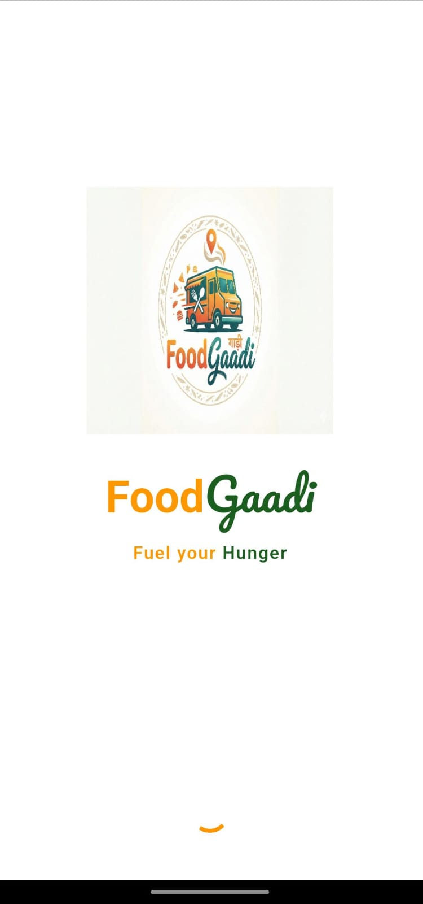
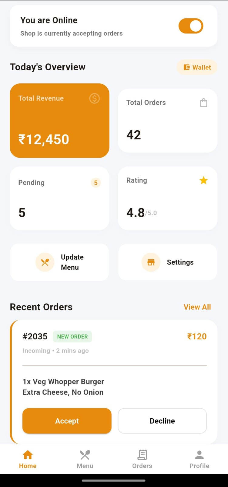
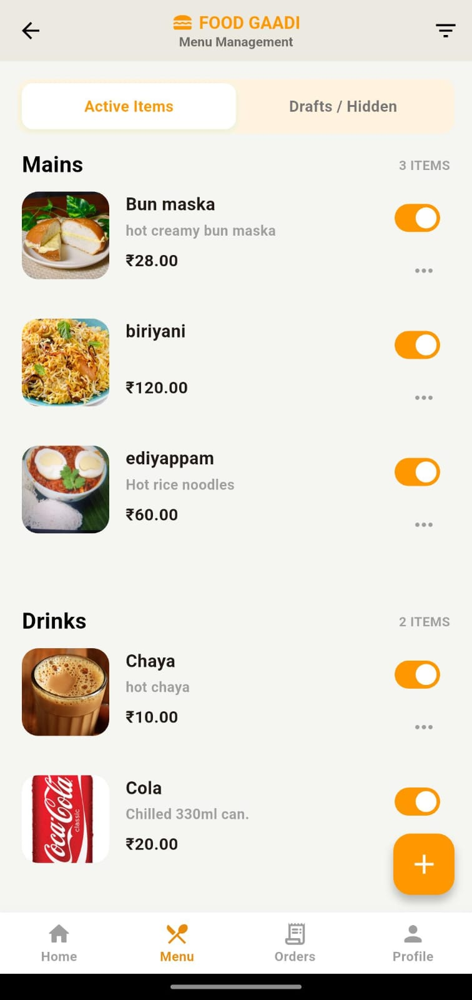
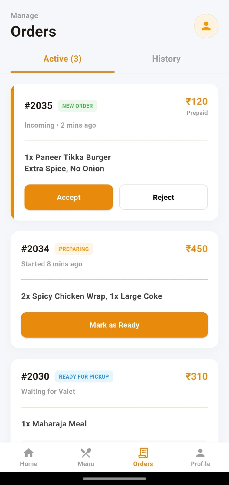
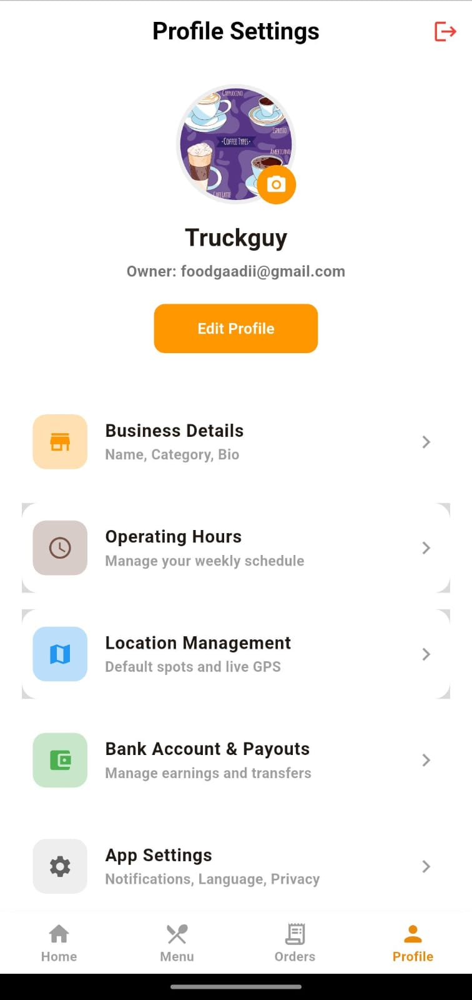

# 🚚 Food Gaadi - Vendor App

**"Fuel Your Hunger"**

Food Gaadi is a professional Flutter application designed for food truck vendors to manage their business operations seamlessly. From tracking real-time orders to managing the menu and monitoring daily revenue, this app serves as a complete digital dashboard for street food entrepreneurs.

---

## 📱 App Screenshots

| Splash Screen | Dashboard | Menu Management | Orders Page | Profile Page |
|:---:|:---:|:---:|:---:|:---:|
|  |  |  |  |  |


---

## ✨ Key Features

### 🔐 Authentication & Onboarding
* **Supabase Auth:** Secure Login and Sign Up.
* **Vendor Profile:** Captures "Food Truck Name" and "Location" (e.g., LPU Block 34) during registration.
* **Auto-Login:** Splash screen checks for existing sessions to skip login.

### 📊 Vendor Dashboard
* **Live Status:** Toggle shop status ("Online/Offline") to control order intake.
* **Business Stats:** View "Total Revenue," "Total Orders," and "Pending Orders" at a glance.
* **Hourly Sales Chart:** Custom-painted visualization of peak business hours.

### 🍔 Menu Management
* **Full CRUD:** Add, Edit, and Delete food items.
* **Live Availability:** Instant toggle switches to mark items as "Active" or "Sold Out."
* **Currency:** All prices displayed in **Indian Rupee (₹)**.
* **Categories:** Organized by "Mains," "Drinks," etc.

### 📝 Order Management
* **Tabbed Interface:** Switch between **Active** orders and **History**.
* **Order Actions:** "Accept," "Reject," or "Mark as Ready" with color-coded status badges.
* **Empty States:** Custom UI when there are no active or past orders.

---

## 🛠️ Tech Stack

* **Frontend:** [Flutter](https://flutter.dev/) (Dart)
* **Backend:** [Supabase](https://supabase.com/) (PostgreSQL, Auth, Realtime)
* **Design:** Google Fonts (Pacifico), Custom Painters (Charts)
* **Icons:** Flutter Launcher Icons

---

## 🚀 Getting Started

Follow these steps to run the project on your machine.

### Prerequisites
* Flutter SDK installed
* VS Code or Android Studio
* A Supabase Project

### Installation

1.  **Clone the repository**
    ```bash
    git clone [https://github.com/YOUR_USERNAME/food_gaadi_app.git](https://github.com/YOUR_USERNAME/food_gaadi_app.git)
    cd food_gaadi_app
    ```

2.  **Install Dependencies**
    ```bash
    flutter pub get
    ```

3.  **Setup Assets**
    Ensure your `assets` folder exists in the root directory:
    * `assets/favicon.png` (Logo)
    * `assets/app_icon.png` (App Icon)

4.  **Configure Supabase**
    Open `lib/main.dart` and enter your keys:
    ```dart
    await Supabase.initialize(
      url: 'YOUR_SUPABASE_URL',
      anonKey: 'YOUR_SUPABASE_ANON_KEY',
    );
    ```

5.  **Run the App**
    ```bash
    flutter run
    ```

---

## 🗄️ Database Schema

Run these SQL commands in your Supabase SQL Editor to set up the tables:

### 1. Profiles Table
```sql
create table public.profiles (
  id uuid references auth.users not null primary key,
  full_name text, -- Stores Truck Name
  location text,  -- Stores Truck Location
  avatar_url text
);


lib/
├── assets/              # Images and Icons
├── screens/
│   ├── login_page.dart       # Auth & Registration
│   ├── dashboard_page.dart   # Main Hub & Stats
│   ├── menu_page.dart        # Menu List & Toggle Logic
│   ├── Orders_page.dart      # Active/History Tabs
│   ├── profile_page.dart     # User Profile & Logout
│   └── add_food_item_page.dart # Add/Edit Item Form
└── main.dart            # Entry point
